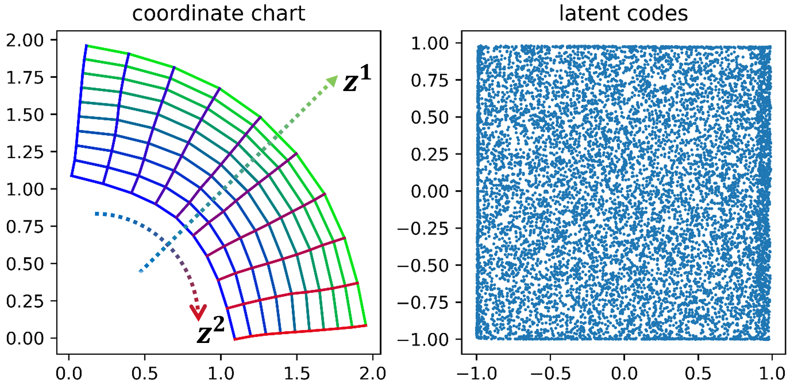
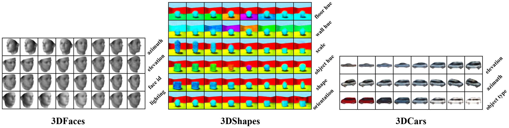

PyTorch code for *Geometric Inductive Biases for Identifiable Unsupervised Learning of Disentangled Representations*.


## Experiments

### Hardware & Software Dependency

- **Hardware**

    All experiments are done using a single NVIDIA RTX-2080Ti GPU.

- **Software**
    
    We use Ubuntu 18.04 platform with Python 3.7 and CUDA 10.1. 
    
    For all dependent libraries, please refer to ```requirements.txt```.
    
### Installation

1. Clone this repository.
    ```
    git clone https://github.com/PanZiqiAI/gdrae.git
    ```

2. Create python environment and install dependent libraries via ```pip```.
    ```
    yes | conda create --prefix=./venv python=3.7
    conda activate ./venv
    pip install -r requirements.txt
    ```

### Training

#### Preparing Datasets
All image datasets should be in directory ```Datasets```. Due to copyright reasons, we do not provide datasets here, please
download the dataset files yourself and prepare datasets as the following instructions. 

- *2DShapes*

    Put the file ```dsprites_ndarray_co1sh3sc6or40x32y32_64x64.npz``` in directory ```Datasets/dsprites```.

- *3DShapes*

    Put the file ```3dshapes.h5``` in directory ```Datasets/3dshapes/raw```.

- *3DFaces*

    Put the file ```basel_face_renders.pth``` in directory ```Datasets/3dfaces```.

- *3DCars*

    Put the file ```car_001_mesh.mat``` - ```car_199_mesh.mat``` in directory ```Datasets/cars3d/raw```.

- *SmallNorb*

    Put the file ```smallnorb-5x01235x9x18x6x2x96x96-testing-cat.mat```, ```smallnorb-5x01235x9x18x6x2x96x96-testing-dat.mat```, 
    ```smallnorb-5x01235x9x18x6x2x96x96-testing-info.mat```, ```smallnorb-5x46789x9x18x6x2x96x96-training-cat.mat```,
    ```smallnorb-5x46789x9x18x6x2x96x96-training-dat.mat```, ```smallnorb-5x46789x9x18x6x2x96x96-training-info.mat``` in directory
    ```Datasets/small_norb/raw```. 

#### Running Experiments

- Train on *Sector2D* Synthetic Manifold
    ```
    cd gdrae-sector-manifold
    python script_train.py --dataset=sector2dunif \
        --lambda_recon=1000.0 --lambda_kld=1000.0 --lambda_jacob_sn=1000.0 --lambda_jacob_sv=1.0 --lambda_capacity=10.0 \
        --desc="sector2dunif/gdrae" 
    ```

- Train on Image Datasets

    The following ```${DATASET}``` argument can be ```shapes2d```, ```shapes3d```, ```faces```, ```cars3d```, ```small_norb```.

    ```
    cd gdrae-images
    python script_train.py --dataset="${DATASET}" --sigma=0.01 \
        --lambda_jacob_sv=0.01 --lambda_norm_logcap=10.0 --lambda_norm_sv=0.01 \
        --desc="${DATASET}/gdrae"
    ```
  
By running the above commands, a directory ```STORAGE/experiments``` will be created, which stores training logs, 
evaluations, visualizations, and saved checkpoints. Another directory ```STORAGE/tensorboard``` will also be created, 
which stores *tensorboardX* visualization of training logs. 

## Results

### Sector2D Synthetic Manifold

<table style="width:auto">
    <tr>
        <td align="center"></td>
    </tr>
</table>
    
### Image Datasets

<table style="width:auto">
    <tr>
        <td align="center"></td>
    </tr>
</table>
